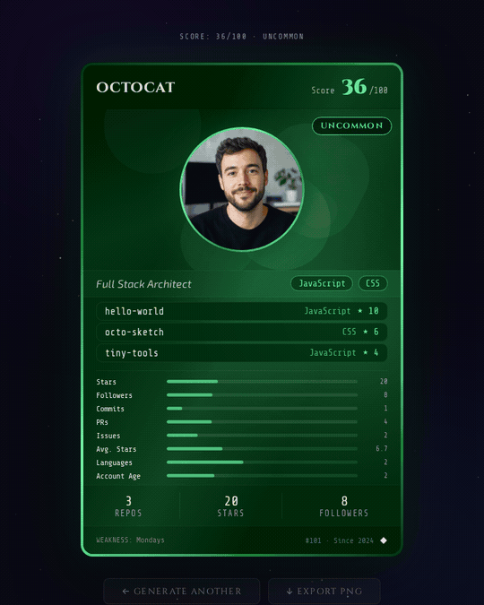

<p align="center">
  
</p>

Generate a trading card from any GitHub profile. Score is calculated from real stats fetched via the GitHub API and the card is rendered as a single self-contained HTML file.

<p align="center">
  
</p>

## Scoring

Each metric uses a logarithmic curve so gains are meaningful at every level, not just for top accounts. Metrics are individually capped and their combined score is capped at 100, allowing different kinds of GitHub activity to reach the top tiers. Repository metrics count original repositories only and include all repository pages returned by GitHub.

| Metric      | Max pts | Full score at    |
| ----------- | ------: | ---------------- |
| Stars       |      35 | 100k stars       |
| Followers   |      30 | 10k followers    |
| PRs         |      20 | 1k pull requests |
| Issues      |      15 | 1k issues        |
| Stars/yr    |      10 | 1k stars/year    |
| Avg. Stars  |      15 | 1k avg per repo  |
| Languages   |      10 | 5+ languages     |
| Account Age |      10 | 8+ years         |

|  Score | Tier      |
| -----: | --------- |
|   0–19 | Common    |
|  20–39 | Uncommon  |
|  40–59 | Rare      |
|  60–79 | Epic      |
| 80–100 | Legendary |

## Development

```bash
yarn install
yarn dev        # http://localhost:8081
yarn build      # outputs dist/index.html (single file)
yarn typecheck
yarn lint
```

To preview a specific rarity tier during development, append `?rarity=legendary` (or any tier name) to the URL.

## Demo GIF

Generate a short, looping GIF that cycles through deterministic sample cards:

```bash
yarn playwright install chromium # first run only
yarn demo:gif                    # writes assets/card-demo.gif
```

The recorder requires `ffmpeg`. Pass a path to write somewhere else, for example
`yarn demo:gif /tmp/cards.gif`. The sample GitHub responses are mocked, so generation does not
consume API requests or depend on network data.
